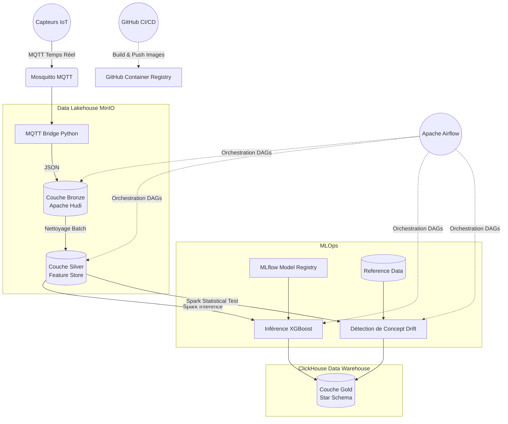

# Maintenance Prédictive pour IoT Industriel avec Data Warehouse Temporel


## 📌 Description du Projet

Ce projet implémente une architecture Data & MLOps complète (End-to-End) pour la **maintenance prédictive de moteurs d'avion (turbofans)**. 
Il simule la réception de données de capteurs IoT en temps réel, traite ces flux à grande échelle via une architecture **Medallion (Bronze, Silver, Gold)**, applique un modèle de Machine Learning pour prédire la Durée de Vie Utile Restante (RUL), surveille la **dérive des données (Concept Drift)** en temps réel, et stocke les résultats dans un Data Warehouse structuré en modèle dimensionnel (Schéma en Étoile) pour la Business Intelligence.

---

## 🏗️ Architecture et Flux de Données

L'architecture repose sur des standards modernes de **Data Lakehouse** (Apache Hudi + MinIO) et de **MLOps** (MLflow + GitHub Actions).



### 1. Ingestion (IoT -> Bronze)
- **MQTT Broker (Mosquitto)** : Reçoit les données de télémétrie en temps réel (21 capteurs + 3 paramètres opérationnels par moteur).
- **MQTT Bridge** : Récupère les messages MQTT et les stocke temporairement au format JSON.
- **Spark Structured Streaming (`mqtt_to_hudi.py`)** : Lit les flux JSON en continu et les insère dans la couche **Bronze** (`brz_sensor_metrics_mqtt`) sur MinIO au format Apache Hudi (Merge-On-Read).

### 2. Nettoyage & Feature Store (Bronze -> Silver)
- **Traitement Batch (`bronze_to_silver.py`)** : Exécuté de façon planifiée par Airflow.
- **Nettoyage et Imputation** : Remplace les valeurs manquantes/aberrantes en utilisant un référentiel historique.
- **Agrégation temporelle** : Calcule des moyennes glissantes sur des fenêtres d'une minute pour lisser le bruit des capteurs.
- **Stockage Silver (Le Feature Store)** : Les données propres et enrichies sont sauvegardées dans `slv_sensor_features` (Hudi). Cette couche agit comme un véritable **Feature Store**. Elle centralise les "features" (caractéristiques) prêtes à l'emploi, garantissant que le modèle ML s'entraîne sur exactement les mêmes transformations de données que celles utilisées lors de l'inférence en production, ce qui élimine le risque de décalage (*Training-Serving Skew*).

### 3. Modélisation MLOps (MLflow + XGBoost)
- **Entraînement (`train_xgboost.py`)** : Un modèle XGBoost est entraîné sur les données historiques pour apprendre à prédire le RUL en fonction de la dégradation des capteurs.
- **MLflow** : Le modèle, ses hyperparamètres, et sa *Signature* (types de données attendus) sont versionnés et enregistrés dans le registre MLflow. Une copie des données d'entraînement est sauvegardée comme référence.

### 4. Inférence & Data Warehouse (Silver -> Gold)
- **Inférence Distribuée (`silver_to_gold_ml.py`)** : Ce job est déclenché par Airflow de manière dynamique (**Data-Aware Scheduling**) dès que la couche Silver est mise à jour. Il récupère le dernier modèle de MLflow, lit les nouvelles *features* Silver, et prédit le RUL pour chaque moteur.
- **Modélisation Dimensionnelle (ClickHouse)** : Le script transforme ensuite les données en un schéma en étoile ultra-performant et l'exporte vers **ClickHouse** (`iot_metrics_DW`) :
  - `dim_engine` : Dimension des moteurs.
  - `dim_date` : Dimension temporelle.
  - `dim_status` : Dimension de santé (Critique, Avertissement, Sain).
  - `fact_engine_health` : Table des faits contenant les 24 capteurs et la prédiction du RUL.

### 5. Surveillance du Modèle (Concept Drift)
- **Détection de Dérive (`detect_drift.py`)** : Déclenché par Airflow juste après l'inférence. Le script utilise `scipy.stats` (Test de Kolmogorov-Smirnov) pour comparer statistiquement les données Silver récentes avec les données de référence de l'entraînement. 
- **Persistance** : Le pourcentage de capteurs ayant dérivé est loggé dans MLflow et inséré dans la table ClickHouse `fact_model_drift` pour alerter les équipes data si le modèle XGBoost devient obsolète.

### 6. Pipeline CI/CD (GitHub Actions)
- **Intégration Continue (CI)** : À chaque Push, le code Python est formaté (`Black`), linté pour chasser les bugs (`Flake8`) et les DAGs Airflow sont testés.
- **Déploiement Continu (CD)** : Les images Docker personnalisées (Spark-Hudi et MQTT-Bridge) sont compilées et publiées automatiquement sur le GitHub Container Registry (GHCR).

---

## 🚀 Stack Technique

* **Langages** : Python 3.11, SQL
* **Streaming & Traitement Distribué** : Apache Spark (PySpark)
* **Data Lakehouse / Stockage** : Apache Hudi, MinIO (compatible S3)
* **Data Warehouse / OLAP** : ClickHouse
* **Orchestration** : Apache Airflow (avec Data-Aware Scheduling / Datasets)
* **Machine Learning & Stats** : XGBoost, Pandas, Scikit-learn, SciPy
* **MLOps** : MLflow
* **IoT / Messagerie** : Eclipse Mosquitto (MQTT)
* **Infrastructure & CI/CD** : Docker, Docker Compose, GitHub Actions

---

## 🛠️ Démarrage Rapide

### 1. Prérequis
- Docker et Docker Compose installés (avec au moins 8 Go de RAM alloués à Docker).
- Git.

### 2. Configurer l'environnement
Clonez le dépôt, puis ouvrez le fichier `docker-compose.yml`. Remplacez la valeur de la variable `PROJECT_HOST_PATH` (lignes 32, 65, 93) par le chemin absolu de votre dossier sur votre ordinateur local (ex: `C:/Users/vous/projet_iot`).

### 3. Lancer l'infrastructure
À la racine du projet, exécutez la commande suivante :
```bash
docker-compose up -d --build
```
*(Patientez quelques minutes le temps que l'initialisation de Spark, Airflow et ClickHouse se termine).*

### 4. Initialiser les données et le simulateur MQTT
Chargez le dataset d'historique initial dans MinIO :
```bash
pip install minio pandas
python upload_to_minio.py
```
Puis, pour commencer à envoyer des données artificielles en temps réel vers le broker MQTT :
```bash
python spark/apps/mqtt_test_stream.py
```

### 5. Interfaces Web (Monitoring)
- **Airflow (Orchestration)** : [http://localhost:8082](http://localhost:8082) (User: `admin` / Pass: `admin`)
- **MinIO (Data Lake)** : [http://localhost:9001](http://localhost:9001) (User: `minio` / Pass: `minio123`)
- **MLflow (MLOps)** : [http://localhost:5000](http://localhost:5000)
- **ClickHouse (Data Warehouse)** : Port `8123` (User: `iot` / Pass: `iot123`)
- **Spark Master UI** : [http://localhost:8080](http://localhost:8080)

---

## 📊 Cas d'Usage BI (Business Intelligence) & Dashboard Power BI

Le Data Warehouse final dans ClickHouse (`iot_metrics_DW`) est connecté à **Power BI** (via ODBC ou le connecteur ClickHouse direct). Un tableau de bord interactif et complet nommé **"Analyse Temporelle de la Maintenance Prédictive des Moteurs"** a été configuré et est fourni directement dans le dossier [PowerBi/](file:///c:/Users/aya/Desktop/projet_iot/-Maintenance-pr-dictive-pour-IoT-industriel-avec-Data-Warehouse-temporel/PowerBi) sous la forme du fichier [Analyse_Maintenance_Predictive_Moteurs.pbix](file:///c:/Users/aya/Desktop/projet_iot/-Maintenance-pr-dictive-pour-IoT-industriel-avec-Data-Warehouse-temporel/PowerBi/Analyse_Maintenance_Predictive_Moteurs.pbix). Il permet de surveiller en temps réel l'état de santé de la flotte de moteurs turbofans (basé sur le jeu de données C-MAPSS de la NASA).

Le dashboard se compose de 5 pages d'analyse spécialisées :

### 1. 🏠 Overview (Vue d'ensemble)
* **Objectif** : Obtenir une visibilité instantanée sur la flotte et isoler immédiatement les moteurs à risque critique.
* **Filtres de navigation (Slicers)** :
  - **Moteur** : Permet de sélectionner un turboréacteur spécifique (ex: `RR-93030`, `CFM-15050`, `CFM-29090`).
  - **Date** : Sélecteur de période temporelle pour analyser des fenêtres d'ingestion spécifiques.
  - **Etat du Moteur** : Filtre global par statut de criticité (`All`, `Sain`, `Avertissement`, `Critique`).
* **Visuels principaux** :
  - **RUL Prédit dans le Temps** : Graphique de courbe linéaire affichant la trajectoire temporelle de la durée de vie utile restante (RUL) estimée par le modèle XGBoost.
  - **Etats des Moteurs Actuels** : Diagramme circulaire (Pie Chart) illustrant la répartition globale des moteurs par état de santé (Sain, Avertissement, Critique).
  - **Résumé des Metrics Actuellement** : Tableau de synthèse affichant les dernières valeurs collectées pour les principaux capteurs (températures de compresseurs, pressions, vitesses physique et corrigée du cœur, débits de refroidissement, etc.).

### 2. 📈 Metrics dans le Temps (Pages 1 & 2)
* **Objectif** : Analyser l'évolution temporelle des capteurs physiques pour diagnostiquer l'usure mécanique.
* **Détail des pages** :
  - **Metrics dans le Temps 1** : Affiche les courbes de tendance pour le RUL prédit, la température de sortie du compresseur HP, la température de sortie du compresseur BP, la pression totale du compresseur HP, la température de sortie de la turbine BP et le ratio carburant/pression.
  - **Metrics dans le Temps 2** : Affiche les courbes de tendance pour la pression statique du compresseur HP, la vitesse physique du cœur, la vitesse corrigée du cœur, l'enthalpie d'air de purge et les débits de refroidissement des turbines HP et BP.

### 3. 🔄 Analyse des Corrélations (Pages 1/2 & 2/2)
* **Objectif** : Identifier et corréler l'évolution des mesures physiques avec la dégradation (chute du RUL) pour valider la pertinence physique du modèle d'IA.
* **Détail des pages** :
  - **Correlation 1/2** : Nuages de points (Scatter Plots) avec courbe de tendance linéaire reliant le RUL prédit (axe Y) aux capteurs principaux : température de sortie du compresseur HP/BP, pression totale du compresseur HP, température de sortie de la turbine BP et ratio carburant/pression.
  - **Correlation 2/2** : Nuages de points avec courbe de tendance linéaire reliant le RUL prédit à la pression statique du compresseur HP, la vitesse physique du cœur, la vitesse corrigée du cœur, l'enthalpie d'air de purge et les débits de refroidissement des turbines HP et BP.
  - *Interprétation physique* :
    - Les températures augmentent à mesure que le RUL baisse (corrélation négative forte, indiquant une surchauffe par frottement).
    - Les débits de refroidissement diminuent à l'approche de la panne (corrélation positive avec le RUL).

---

### 🔌 Guide de Connexion ClickHouse ➔ Power BI

Pour alimenter ce dashboard depuis votre environnement local dockerisé :

#### Option A : Via le connecteur natif ClickHouse
1. Ouvrez **Power BI Desktop**, cliquez sur **Obtenir des données** -> **Plus...**
2. Recherchez et sélectionnez le connecteur officiel **ClickHouse**.
3. Renseignez l'hôte : `localhost:8123` et la base de données : `iot_metrics_DW`.
4. Sélectionnez le mode de connexion :
   - **DirectQuery** (Recommandé pour un suivi en temps réel du flux de streaming MQTT).
   - **Import** (Pour une performance de calcul maximale en local).
5. Renseignez les identifiants : Utilisateur `iot` / Mot de passe `iot123`.

#### Option B : Via un pilote ODBC
1. Installez le pilote **ClickHouse ODBC Driver** (Unicode) sur votre machine Windows.
2. Créez un DSN Système dans l'Administrateur de sources de données ODBC :
   - *Host* : `localhost`
   - *Port* : `8123`
   - *Database* : `iot_metrics_DW`
   - *User* : `iot` / *Password* : `iot123`
3. Dans Power BI, connectez-vous via la source de données **ODBC** en sélectionnant votre DSN.

